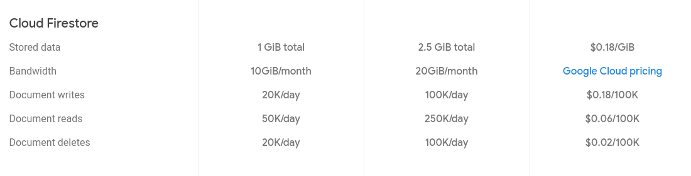

# Stuttherapy

## Architecture

## Technologies used

## Database

### Resource

- [Firebase plans](https://firebase.google.com/pricing?authuser=0)
- [Add Firebase to your Flutter app](https://firebase.google.com/docs/flutter/setup)

### Annexe

*Firestore prices (July 27, 2019) :*

*First column : Free plan, Second column : 25$/Month, Third column : Pay as you go*

## Signed app

You can find a copy of the keystore in the following file : `./key.jks.save` (not available on the git repo)
